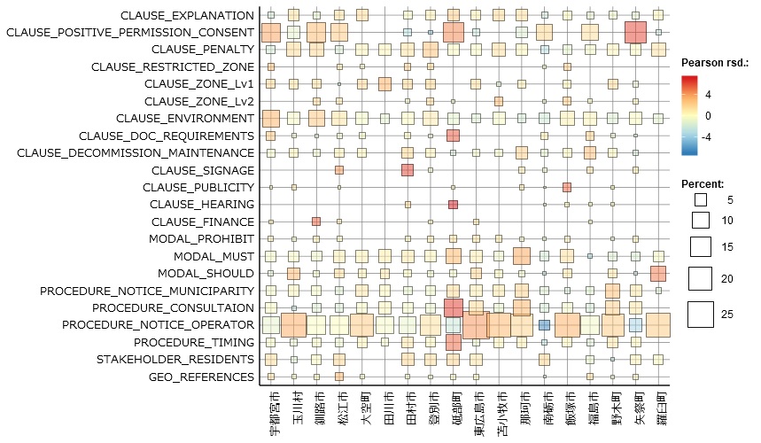
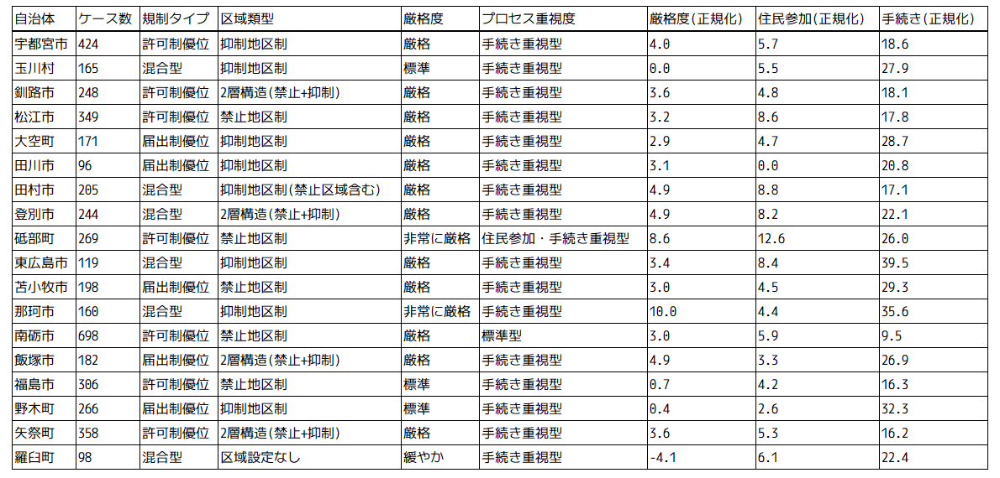

# Text Analysis Report on Solar Power Regulation Ordinances
v.1.00
October 28, 2025 — Ikkou Fujishima

## Introduction
This report (v.1.00) summarizes the results obtained as of October 28, 2025. We plan to improve the coding rules and expand the set of ordinances analyzed in future editions, and aim to publish an updated version. Planned improvements to the coding rules are described below. The main purpose of this version is to validate the feasibility and practical effectiveness of the analysis methods.

## Objectives of the Analysis

This report aims to quantitatively characterize how local governments address solar power generation by analyzing the texts of recently adopted ordinances regulating photovoltaic installations. Specifically, we extract features of ordinances from perspectives such as zoning, consultation, notification (filing), permission (approval), and penalties, and identify differences among municipalities. In the longer term, we also consider using FIT (Feed-in Tariff) project certification data to evaluate the contribution of ordinances to the development of solar projects.

## Methods

The corpus consists of ordinance texts and enforcement rules issued by local governments that regulate solar power installations. For this report (v.1.00) we targeted ordinances enacted in 2025[^1]. For items available as HTML, we extracted the text directly. For PDFs we used OCR to obtain text data.

We used KH Coder for the analysis. We defined our own coding rules and extracted and classified keywords related to zoning, consultation, notification, permission, and penalties. The coding rules are listed below (Table 1).

### Table 1: List of coding rules

| Title | CLAUSE_EXPLANATION | Short summary |
| :--- | :--- | :--- |
| **CLAUSE_EXPLANATION** | Notes on holding briefings or public information for residents and neighboring communities. | Implementation of briefings/public information. |
| **CLAUSE_NEGATIVE_PERMISSION_CONSENT** | Negative determinations such as denying permission, approval, consent, or authorization. | Denial/negative judgment. |
| **CLAUSE_POSITIVE_PERMISSION_CONSENT** | Affirmative determinations granting permission, approval, consent, or authorization. | Permission/affirmative judgment. |
| **CLAUSE_PENALTY** | Penal measures including fines or administrative penalties, and sanctions such as recommendations, orders, and publicity. | Sanctions/penalties. |
| **CLAUSE_RESTRICTED_ZONE** | Location constraints such as landslide warning zones, protected forests, cultural properties, river/coast conservation areas, etc. | Location-restricted zones. |
| **CLAUSE_ZONE_LV1** | Setting of mild regulation zones/areas such as restraint, limitation, or conservation zones. | Mild regulation zones. |
| **CLAUSE_ZONE_LV2** | Setting of strong regulation zones/areas characterized by prohibition. | Strong regulation zones (prohibition). |
| **CLAUSE_ENVIRONMENT** | Terms related to environmental impacts such as noise, vibration, spring water emergence, landscape, ecosystems, water quality, soil, and deforestation. | Environmental impacts. |
| **CLAUSE_DOC_REQUIREMENTS** | Requirements for documents, plans, drawings, and attachments necessary for applications/notifications/submissions. | Document/material requirements. |
| **CLAUSE_DRAWINGS** | Drawings such as location maps, plan views, cross-sections, various planning maps, cadastral maps, and current-condition photographs. | Drawings and maps. |
| **CLAUSE_DECOMMISSION_MAINTENANCE** | Obligations related to removal/restoration to original state, maintenance, inspection, and repair. | Decommissioning/maintenance/repair. |
| **CLAUSE_SIGNAGE** | Provisions concerning installation, display, or posting of signs at the site. | Signage/display requirements. |
| **CLAUSE_PUBLICITY** | Publication procedures such as public notices, promulgation, public inspection, and public comment solicitation. | Publication procedures. |
| **CLAUSE_HEARING** | Procedures for hearing residents' opinions, including public hearings, hearings, and opinion solicitation. | Procedures for hearing stakeholder views. |
| **CLAUSE_FINANCE** | Financial and guarantee conditions such as funding plans, deposits, collateral, insurance, and contributions. | Financial/guarantee conditions. |
| **CLAUSE_EQUIPMENT_NOISE** | Descriptions related to noise and low frequency sound originating from power conditioners/inverters (PCS). | Equipment noise/low-frequency sound. |
| **MODAL_PROHIBIT** | Prohibitive modal expressions such as "shall not" or "is prohibited." | Prohibition expressions. |
| **MODAL_MUST** | Strong obligation expressions such as "must" (excluding mere best-effort obligations). | Strong obligation expressions. |
| **MODAL_SHOULD** | Effort or recommendation expressions such as "should endeavor to," "take into account," or "desirable." | Best-effort/recommendation expressions. |
| **GUARD_EXCEPTION_TADASHI** | Exception clauses introduced by phrases like "provided that..." | Exception clauses. |
| **PROCEDURE_NOTICE_MUNICIPALITY** | Procedures in which the administration (municipalities, etc.) issues notices, instructions, orders, or requests. | Administrative notices/instructions/orders. |
| **PROCEDURE_CONSULTAION** | Procedures for "consultation" with stakeholders or administrative bodies. | Consultation with stakeholders/administration. |
| **PROCEDURE_NOTICE_OPERATOR** | Notification obligations by operators such as reporting, contact, and filing. | Notifications/reports/filings by operators. |
| **PROCEDURE_TIMING** | Procedural timing requirements such as prior to commencement, before implementation, deadlines, and due dates. | Timing requirements for procedures. |
| **STAKEHOLDER_RESIDENTS** | Resident stakeholders such as neighboring and related local residents. | Resident stakeholders. |
| **STAKEHOLDER_LANDOWNER** | Landowners, rights holders, and related rights holders. | Landowners/rights holders. |
| **GEO_REFERENCES** | References to topography and water bodies such as valleys, ravines, steep slopes, waterways, rivers, reservoirs, retention ponds, mountain ranges, roofs, and gullies. | Geographical/water references. |

In this paper we primarily analyzed coding frequency in each ordinance and used the cross-tabulation feature to extract municipality-level coding frequencies for comparative analysis.

Using coding frequencies, we classified ordinances by municipal characteristics. Specifically, we categorized ordinances according to four perspectives listed below:

1. **Determination of Permit-based vs. Notification-based systems:** We judged this using the occurrence frequencies of `CLAUSE_POSITIVE_PERMISSION_CONSENT` (permission/approval) and `PROCEDURE_NOTICE_OPERATOR` (notification) combined with Pearson residuals. Because legal texts tend to use the term "permission" cautiously, we considered a clause to be characteristic of a municipality if its Pearson residual exceeded +1.0. We classified ordinances into three types: permission-dominant, notification-dominant, and mixed.

2. **Zoning typology:** We determined zoning type by combining the presence of `CLAUSE_ZONE_LV1` (restraint zones) and `CLAUSE_ZONE_LV2` (prohibition zones) with Pearson residuals. We placed emphasis on the presence of the strong wording "prohibition" and classified municipalities into prohibition-based zoning, restraint-based zoning, two-tier zoning (prohibition + restraint), or no zoning.

3. **Evaluation of strictness:** From modal expressions (`MODAL_PROHIBIT`, `MODAL_MUST`, `MODAL_SHOULD`), we evaluated regulatory strictness. We calculated a strictness score as "prohibition expressions + strong obligation expressions - best-effort expressions," normalized by case count to enable comparisons across municipalities. Based on the score, municipalities were classified into four levels: very strict, strict, standard, and lenient.

4. **Emphasis on procedures and public participation:** Based on clauses related to resident involvement and procedures (`CLAUSE_EXPLANATION`, `CLAUSE_HEARING`, `STAKEHOLDER_RESIDENTS`, `PROCEDURE_CONSULTAION`, etc.), we assessed whether an ordinance prioritized process. We computed a resident participation score and a procedure score, and classified municipalities as resident-participation-and-procedure-focused, resident-participation-focused, procedure-focused, or standard.

The specific decision criteria and thresholds for each classification are summarized in Table 2 below.

### Table 2: Classification criteria and thresholds

| Classification perspective | Indicator | Categories | Decision rules |
| :--- | :--- | :--- | :--- |
| **1. Regulatory type** | Frequency of permission vs. notification and Pearson residuals | Permission-dominant | (1) Permission Pearson residual > 1.0, or (2) Permission > 0 and (Notification = 0 or Permission/Notification ≥ 0.5) |
|  |  | Notification-dominant | (1) Notification Pearson residual > 1.0 and Permission Pearson residual < 1.0, or (2) Permission = 0 and Notification > 0 |
|  |  | Mixed | Otherwise |
|  |  | Not specified | Permission = 0 and Notification = 0 |
| **2. Zoning type** | Presence of restraint/prohibition zones and Pearson residuals | Prohibition-based | (1) Prohibition zone Pearson residual > 1.0 (excluding two-tier structures), or (2) Prohibition zone > 0 and Restraint zone < Prohibition zone × 2 |
|  |  | Restraint-based | (1) Restraint zone Pearson residual > 1.0 and Prohibition zone Pearson residual < 1.0, or (2) Prohibition zone = 0 and Restraint zone ≥ 3 |
|  |  | Two-tier (prohibition + restraint) | Restraint zone ≥ 3 and Prohibition zone ≥ 3 |
|  |  | Restraint-based (including prohibition) | Prohibition zone > 0 and Restraint zone ≥ Prohibition zone × 2 |
|  |  | Zoning present (minor) | Restraint zone > 0 or Prohibition zone > 0 (other cases) |
|  |  | No zoning | Restraint zone = 0 and Prohibition zone = 0 |
| **3. Strictness level** | Normalized strictness score = (Prohibition expressions + Strong obligation expressions - Best-effort expressions) / Case count × 100 | Very strict | Normalized score ≥ 5.0 |
|  |  | Strict | 2.0 ≤ Normalized score < 5.0 |
|  |  | Standard | 0.0 ≤ Normalized score < 2.0 |
|  |  | Lenient | Normalized score < 0.0 |
| **4. Emphasis on process** | Resident participation score (normalized) = (Briefings + Opinion hearings + Resident involvement) / Case count × 100  Procedure score (normalized) = (Consultation + Administrative notices + Notifications) / Case count × 100 | Resident & procedure-focused | Resident participation score ≥ 10.0 and Procedure score ≥ 15.0 |
|  |  | Resident-focused | Resident participation score ≥ 10.0 and Procedure score < 15.0 |
|  |  | Procedure-focused | Resident participation score < 10.0 and Procedure score ≥ 15.0 |
|  |  | Standard | Resident participation score < 10.0 and Procedure score < 15.0 |

Note: We adopted a Pearson residual threshold of 1.0 as a practical guideline. While residuals exceeding ±1.96 and ±2.58 correspond to statistical significance at the 5% and 1% levels respectively, we used 1.0 in this textual analysis of legal documents to capture practically meaningful deviations.

[^1]: Local Autonomy Research Institute, 2025, "Ordinances Concerning Regulation of Solar Power Generation Facilities" https://www.rilg.or.jp/htdocs/img/reiki/005_solar.htm (accessed October 28, 2025).

## Results

Figure 1 shows KH Coder cross-tabulation results.

Figure 1: Cross-tabulation results from KH Coder.

Bubble size indicates the occurrence frequency (%) of each coding. Bubble color represents the Pearson residual and shows the degree of deviation from expected values.
Because many of these ordinances were enacted for similar purposes, there are numerous codings commonly present across municipalities.

Based on the cross-tabulation above, we classified municipal ordinances according to the four perspectives described earlier. The municipal classification results are shown below.

### Table 3: Municipal classification results

From the results, the zoning typology appears to have been classified correctly. On the other hand, the regulatory type classification has been affected by noisy expressions such as "~is deemed to be," which has led to over-classification as mixed or permission-dominant. Additionally, questions remain about whether municipalities labeled as strict are truly strict in practice. As for emphasis on process, the procedure-focused category is overwhelmingly common; while this is largely reasonable, there are areas for improvement—for example, Rausu Town, which imposes a resident consent requirement, was classified as procedure-focused, indicating the need for refinement.

## Improvements

### Coding rules
- CLAUSE_SIGNAGE: The phrase "post/put up (掲示する)" is currently being missed.
- CLAUSE_PENALTY: Penal provisions should be split into two tiers: fines/penalties and measures such as orders, publicity, and recommendations.
- CLAUSE_POSITIVE_PERMISSION_CONSENT: Exclude expressions such as "is deemed to be~" from this coding.
- CLAUSE_CONSENT_RESIDENCE: Newly add this code to capture clauses that require obtaining resident consent.

### Dataset
- Expand the ordinance collection to include ordinances enacted in years other than 2025.
- Remove forced line breaks within articles/paragraph numbering and keep them within the same paragraph.

### Classification criteria
- Reexamine the strictness score calculation method.

