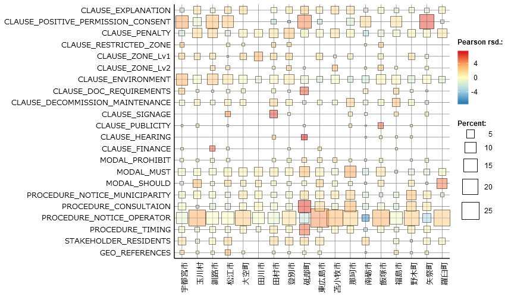
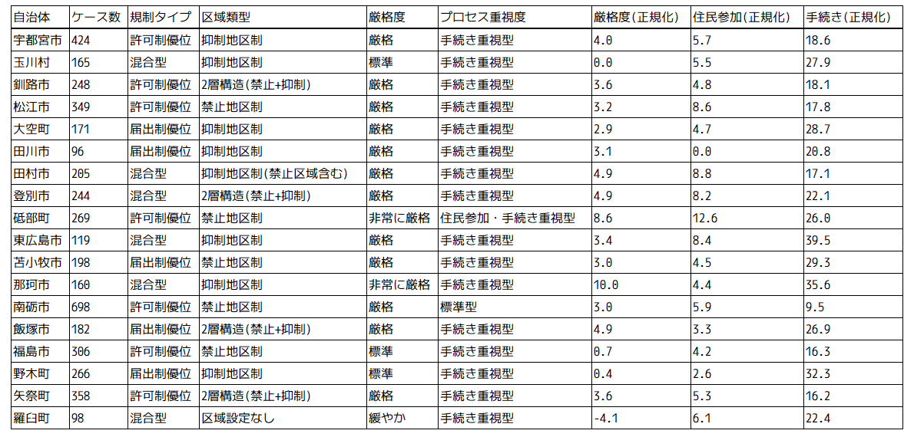

# 太陽光発電規制条例のテキスト分析レポート
v.1.00
2025年10月28日 藤嶋一行

## はじめに
本レポートバージョン(v.1.00)では, 2025年10月28日時点で得られた成果をまとめた. コーディングルールの改善と分析対象条例の増加を今後予定しており, 次版での更新を目指す. コーディングルールの改善予定内容は後述する. 今版においては, 分析手法の確率と実効性の検証を主な目的としている. 

## 分析の目的

本レポートでは, 近年増加している太陽光発電規制条例のテキストを分析することによって, 各自治体の太陽光発電への対応を計量的に把握することを目的としています. 具体的には, 区域設定・協議・届出・許可・罰則などの観点から, 条例の特徴を抽出し, 自治体間の違いを明らかにします. また, 将来的な目的として, FIT事業計画認定情報を利用して, 太陽光発電事業の展開寄与度を評価することも視野に入れています.

## 分析方法

使用するテキストは, 各自治体の太陽光発電規制条例の条文と施行規則である. 本レポートバージョン(v.1.00)では, 2025年に制定された条例を対象[^1]とした. HTML形式で提供されているものについては, テキスト抽出を行った. PDF形式のものについては, OCR処理を用いてテキストデータを取得した. 

分析には, KH Coderを使用した. 独自にコーディングルールを設定し, 区域設定・協議・届出・許可・罰則に関連するキーワードを抽出して分類した. コーディングルールについては以下に示す(表1)とおりである. 

### 表1: コーディングルール一覧
| タイトル | CLUASE_EXPLANATION | 短い要約 |
| :--- | :--- | :--- |
| **CLAUSE_EXPLANATION** | 住民・近隣への説明会や周知の実施に関する記載。 | 説明会・周知の実施。 |
| **CLAUSE_NEGATIVE_PERMISSION_CONSENT** | 許可・承認・同意・認可を「しない/不許可」とする否定的判断。 | 不許可・否定的判断。 |
| **CLAUSE_POSITIVE_PERMISSION_CONSENT** | 許可・承認・同意・認可を与える肯定的判断。 | 許可・肯定的判断。 |
| **CLAUSE_PENALTY** | 罰則・罰金・過料、勧告・命令・公表等の制裁措置。 | 制裁措置。 |
| **CLAUSE_RESTRICTED_ZONE** | 土砂災害警戒等の各種指定区域・保安林・文化財・河川/海岸保全区域など立地制約。 | 立地制約区域。 |
| **CLAUSE_ZONE_LV1** | 抑制・制限・保全などの緩めの規制区域・地区の設定。 | 緩めの規制区域。 |
| **CLAUSE_ZONE_LV2** | 「禁止」レベルの強い規制区域・地区の設定。 | 強い規制区域（禁止）。 |
| **CLAUSE_ENVIRONMENT** | 騒音・振動・湧水・景観・生態系・水質・土壌・伐採等の環境影響に関する語。 | 環境影響。 |
| **CLAUSE_DOC_REQUIREMENTS** | 申請/届出/提出に必要な書類・計画書・図面・添付資料の要求。 | 書類・資料の要求。 |
| **CLAUSE_DRAWINGS** | 位置図、平面図、断面図、各種計画図、公図、現況写真など図面類。 | 図面類。 |
| **CLAUSE_DECOMMISSION_MAINTENANCE** | 撤去・原状回復、維持管理・保守・点検・補修に関する義務。 | 撤去・維持管理・補修。 |
| **CLAUSE_SIGNAGE** | 現地への標識・掲示の設置・表示・掲出に関する規定。 | 標識・掲示の設置。 |
| **CLAUSE_PUBLICITY** | 公表・告示・公示、縦覧、意見公募（パブコメ）などの公表手続。 | 公表手続。 |
| **CLAUSE_HEARING** | 公聴会・聴聞・意見聴取により住民等の意見を聞く手続。 | 住民等の意見聴取手続。 |
| **CLAUSE_FINANCE** | 資金計画、保証金、担保、保険、負担金などの資金・保証条件。 | 資金・保証条件。 |
| **CLAUSE_EQUIPMENT_NOISE** | パワーコン/インバータ (PCS) 由来の騒音・低周波音に関する記述。 | 設備騒音・低周波音。 |
| **MODAL_PROHIBIT** | 「してはならない」「禁止する」等の禁止表現。 | 禁止表現。 |
| **MODAL_MUST** | 「しなければならない」等の強い義務表現 (努力義務は除外)。 | 強い義務表現。 |
| **MODAL_SHOULD** | 「努める」「配慮する」「望ましい」等の努力義務・推奨表現。 | 努力義務・推奨表現。 |
| **GUARD_EXCEPTION_TADASHI** | 「ただし…場合」「但し…場合」による例外規定。 | 例外規定。 |
| **PROCEDURE_NOTICE_MUNICIPALITY** | 行政 (市町村等) が通知・指示・命令・要請を行う手続。 | 行政による通知・指示・命令。 |
| **PROCEDURE_CONSULTAION** | 関係者・行政との「協議」手続。 | 関係者・行政との協議。 |
| **PROCEDURE_NOTICE_OPERATOR** | 事業者による報告・連絡・届出等の通知義務。 | 事業者による通知・報告・届出。 |
| **PROCEDURE_TIMING** | 事前・着手前、実施前、期限・期日・までに等の手続時期要件。 | 手続時期要件。 |
| **STAKEHOLDER_RESIDENTS** | 近隣・関係地域住民等の住民ステークホルダー。 | 住民ステークホルダー。 |
| **STAKEHOLDER_LANDOWNER** | 土地所有者・地権者・関係権利者等の権利者。 | 土地所有者・権利者。 |
| **GEO_REFERENCES** | 谷・沢・急斜面・水路・河川・ため池・調整池・山脈・屋根・谷筋等の地形・水域参照。 | 地形・水域参照。 | 

本稿では主に, 各条例におけるコーディング結果の頻度分析を行い, 自治体間での比較を行うために, 「クロス集計」機能を用いて, 自治体別のコーディング頻度を抽出した. 

コーディング頻度を使用して, 各自治体の特性をもとに分類して分析を行った. 具体的には, 以下の4つの観点から自治体の条例を類型化した:

1. **許可制 vs 届出制の判定**: `CLAUSE_POSITIVE_PERMISSION_CONSENT`(許可・承認)と`PROCEDURE_NOTICE_OPERATOR`(届出)の出現頻度に加え, Pearson残差を組み合わせて判定した. 法律文書では「許可」という文言は慎重に使用されるため, Pearson残差が+1.0以上の場合, その条項が自治体で特徴的に重視されていると判断した. 許可制優位・届出制優位・混合型の3分類を行った.

2. **区域設定の類型化**: `CLAUSE_ZONE_Lv1`(抑制区域)と`CLAUSE_ZONE_Lv2`(禁止区域)の設定状況とPearson残差を組み合わせて判定した. 「禁止」という強い文言の存在を重視し, 禁止地区制・抑制地区制・2層構造(禁止+抑制)・区域設定なしなどに分類した.

3. **条例の厳格度評価**: モーダル表現(`MODAL_PROHIBIT`, `MODAL_MUST`, `MODAL_SHOULD`)から, 条例の規制強度を評価した. 厳格度スコアを「禁止表現 + 強い義務表現 - 努力義務表現」として算出し, ケース数で正規化することで, 自治体間の比較を可能にした. スコアに基づいて, 非常に厳格・厳格・標準・緩やかの4段階に分類した.

4. **手続き・住民参加の重視度**: 住民関与や手続きに関する条項(`CLAUSE_EXPLANATION`, `CLAUSE_HEARING`, `STAKEHOLDER_RESIDENTS`, `PROCEDURE_CONSULTAION`など)から, プロセス重視型かどうかを評価した. 住民参加スコアと手続きスコアを算出し, 住民参加重視型・手続き重視型・住民参加・手続き重視型・標準型に分類した.

各分類の具体的な判定基準と閾値は表2のとおりである.

### 表2: 分類基準と閾値一覧

| 分類観点 | 判定指標 | 分類カテゴリ | 判定条件 |
| :--- | :--- | :--- | :--- |
| **1. 規制タイプ** | 許可・届出の頻度とPearson残差 | 許可制優位 | (1) 許可のPearson残差 > 1.0, または (2) 許可 > 0 かつ (届出 = 0 または 許可/届出 ≥ 0.5) |
|  |  | 届出制優位 | (1) 届出のPearson残差 > 1.0 かつ 許可のPearson残差 < 1.0, または (2) 許可 = 0 かつ 届出 > 0 |
|  |  | 混合型 | 上記以外 |
|  |  | 規定なし | 許可 = 0 かつ 届出 = 0 |
| **2. 区域類型** | 抑制・禁止区域の設定とPearson残差 | 禁止地区制 | (1) 禁止区域のPearson残差 > 1.0 (ただし2層構造を除く), または (2) 禁止区域 > 0 かつ 抑制区域 < 禁止区域 × 2 |
|  |  | 抑制地区制 | (1) 抑制区域のPearson残差 > 1.0 かつ 禁止区域のPearson残差 < 1.0, または (2) 禁止区域 = 0 かつ 抑制区域 ≥ 3 |
|  |  | 2層構造(禁止+抑制) | 抑制区域 ≥ 3 かつ 禁止区域 ≥ 3 |
|  |  | 抑制地区制(禁止区域含む) | 禁止区域 > 0 かつ 抑制区域 ≥ 禁止区域 × 2 |
|  |  | 区域設定あり(少数) | 抑制区域 > 0 または 禁止区域 > 0 (上記以外) |
|  |  | 区域設定なし | 抑制区域 = 0 かつ 禁止区域 = 0 |
| **3. 厳格度レベル** | 厳格度スコア(正規化) = (禁止表現 + 義務表現 - 努力義務) / ケース数 × 100 | 非常に厳格 | スコア(正規化) ≥ 5.0 |
|  |  | 厳格 | 2.0 ≤ スコア(正規化) < 5.0 |
|  |  | 標準 | 0.0 ≤ スコア(正規化) < 2.0 |
|  |  | 緩やか | スコア(正規化) < 0.0 |
| **4. プロセス重視度** | 住民参加スコア(正規化) = (説明会 + 意見聴取 + 住民関与) / ケース数 × 100  手続きスコア(正規化) = (協議 + 行政通知 + 届出) / ケース数 × 100 | 住民参加・手続き重視型 | 住民参加スコア(正規化) ≥ 10.0 かつ 手続きスコア(正規化) ≥ 15.0 |
|  |  | 住民参加重視型 | 住民参加スコア(正規化) ≥ 10.0 かつ 手続きスコア(正規化) < 15.0 |
|  |  | 手続き重視型 | 住民参加スコア(正規化) < 10.0 かつ 手続きスコア(正規化) ≥ 15.0 |
|  |  | 標準型 | 住民参加スコア(正規化) < 10.0 かつ 手続きスコア(正規化) < 15.0 |

注: Pearson残差の閾値1.0は, 標準化残差として一般的な目安である. 残差が±1.96を超えると5%水準で統計的に有意, ±2.58を超えると1%水準で有意となるが, 本分析では法令のテキスト分析であることを踏まえて1.0を採用した.

[^1]: 地方自治研究機構, 2025, 「太陽光発電設備の規制に関する条例」https://www.rilg.or.jp/htdocs/img/reiki/005_solar.htm（2025年10月28日最終閲覧）.

## 分析結果
KH Coderでのクロス集計結果を図1に示す. 

図1: KH Coder によるクロス集計結果

バブルの大きさは各コーディングの出現頻度(%)を示す. また, バブルカラーはPearson残差を示しており, 期待される数値からの乖離度合いを表している. 
同じ目的のために制定された条例を比較対象としている影響で, 各自治体の条例に共通して含まれるコーディングも多い. 

上記のクロス集計結果をもとに, 各自治体の条例を4つの観点から類型化した結果を以下に示す.

### 表3: 自治体別分類結果一覧

結果から, 区域類型は正しく分類ができているといえる. 一方で, 規制タイプについては「~と認める」という言い回しがノイズとなっており, 混合型・許可制優位が実際よりも多い. また, 厳格度についても, 厳格とされている自治体が実際に厳格といえるかは疑問が残る. プロセス重要度については手続き重視型が圧倒的多数であり, これには同意する一方で, 住民同意取得義務を課す羅臼町が手続き重視型に分類されているなど, 改善点が見られた. 

## 改善点

### コーディングルール
- CLAUSE_SIGNAGE: 「掲示する」という表現を見逃している. 
- CLAUSE_PENALTY: 罰則・罰金, 命令・公表・勧告の2階層に分ける必要. 
- CLAUSE_POSITIVE_PERMISSION_CONSENT: 「~と認める」という表現を除外する必要.
- CLAUSE_CONSENT_RESIDENCE: 新規追加. 住民同意取得義務に関する条項を抽出するため.

### データセット
- 分析対象条例の増加: 2025年制定以外の条例も含める.
- 項, 号について改行を排し, 同段落に含める. 

### 分類基準
- 厳格度スコアの計算方法見直し
